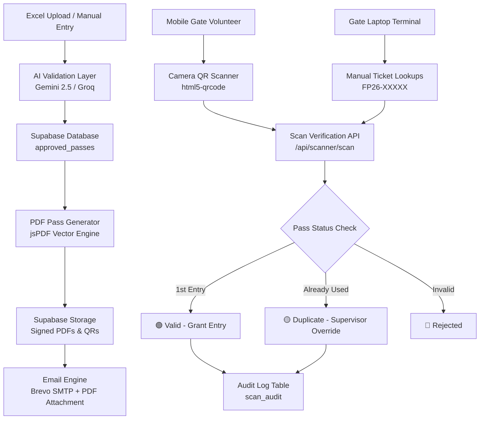

# 🎟️ Fresher Party 2026 — Gate Entry Security & Pass Management System

[](https://nextjs.org/)
[](https://www.typescriptlang.org/)
[](https://supabase.com/)
[](https://tailwindcss.com/)
[](https://ai.google.dev/)
[](https://www.brevo.com/)

A production-grade, full-stack event ticketing and access control platform engineered for **Fresher Party 2026 (Campus of I&CS, Dawood University of Engineering & Technology)**. Built to process thousands of student registrations, generate encrypted PDF passes, dispatch branded emails with failover, and perform sub-second QR code gate check-ins with anti-counterfeit protection.

---

## 🌟 Key Features

### 1. 🎫 Dynamic PDF Pass Generator
- Generates print-ready, landscape **200mm × 100mm** vector tickets dynamically using `jsPDF`.
- Embeds high-resolution event artwork, student name, roll number, non-sequential **5-digit random Ticket IDs (`FP26-XXXXX`)**, and synchronized QR codes inside designated containers.
- Generates compressed PDFs uploaded directly to Supabase Storage with signed short-lived caching URLs.

### 2. 📷 Real-Time Mobile QR Scanner
- Browser-based camera scanner powered by `html5-qrcode` designed specifically for iOS Safari and Android Chrome.
- **Continuous Camera Stream**: Viewfinder stays permanently mounted to eliminate hardware disconnects, permission re-prompts, and battery drain.
- **Three-State Visual Feedback**:
  - 🟢 **Valid First Entry**: Attendee details verified, entry time logged, single-entry rule enforced.
  - 🟡 **Duplicate Scan Warning**: Displays original scan time and scanner identity with an authorized Supervisor Force-Override option.
  - 🔴 **Invalid / Expired Pass**: Visual alert blocking unauthorized entry.
- **Permanent Manual Input**: Allows gate volunteers to type raw 5-digit ticket numbers or roll numbers directly.

### 3. 🛡️ Role-Based Access Control (RBAC) & Security Hardening
- 4 distinct role tiers:
  - **`PROJECT_MANAGER`**: Full platform control, invites, audit logs, and system analytics.
  - **`ENTRY_MANAGER`**: Pass management, Excel batch approvals, manual entry creation.
  - **`ENTRY_SUPERVISOR`**: Gate monitoring and duplicate scan override permissions.
  - **`SCANNER`**: High-speed volunteer camera scanning access.
- Security Highlights:
  - Secure HTTP-only JWT cookies (`jose`) with 1-hour admin session expiry and 8-hour volunteer session expiry.
  - Password hashing with `bcryptjs`.
  - Token-gated volunteer portal preventing public tampering.
  - Comprehensive immutable audit trail logging all actions with user agent, IP, and timestamp.

### 4. 🤖 AI-Powered Excel Upload & Batch Validation
- Ingests bulk `.xlsx`, `.xls`, and `.csv` student registration lists.
- **Dual-Layer Validation**:
  - Primary: Deterministic rule verification (flexible roll number regex, email syntax checks).
  - Secondary: **Google Gemini 2.5 Flash** with **Groq Cloud (`qwen/qwen3.8-27b`)** backup for anomaly and duplicate detection.
- **Smart Field Auto-Derivation**: Automatically extracts missing departments and batches from student roll numbers (e.g. `24F-CS-878` → Batch `2024`, Dept `BS Computer Science`) so valid students are never dropped.
- **Existing Pass Protection**: Automatically cross-references uploaded students with the database, categorizing existing passes as **Already Generated (Skipped)** to prevent duplicate tickets.

### 5. 📧 Failover Email Delivery & Quota Engine
- Direct Brevo SMTP integration with pass PDF directly attached to outgoing emails.
- **Multi-Tier Provider Failover**: Primary Brevo API → Secondary Brevo API → Groq Notification Fallback.
- **Smart Quota Tracking**: Tracks hourly (70/hr) and daily (500/day) provider limits.
- **Persistent Email Queue**: Automatically falls back to queueing if provider limits are exceeded, with asynchronous worker processing via Vercel Cron.

### 6. 🖥️ Gate Check-in Desktop Terminal
- Kiosk-mode interface optimized for gate laptops, barcode guns, and rapid manual lookups.
- Auditory feedback via Web Audio API for success, duplicate warning, and error states.
- Live session history table showing all passes processed at that terminal.

---

## 🛠️ Technology Stack

| Layer | Technologies |
| :--- | :--- |
| **Frontend** | Next.js 14 (App Router), React 18, TypeScript, Tailwind CSS, Lucide Icons |
| **Backend** | Next.js Route Handlers, Edge Middleware |
| **Database & Storage** | Supabase (PostgreSQL 15, Supabase Storage, Row Level Security) |
| **Authentication** | `jose` (JWT), `bcryptjs`, Secure HTTP-Only Cookies |
| **Email Service** | Brevo (Sendinblue) SMTP API, Vercel Cron Jobs |
| **Artificial Intelligence** | Google Gemini 2.5 Flash, Groq Cloud API (`qwen/qwen3.8-27b`) |
| **Document Processing** | `jsPDF`, `xlsx`, `qrcode`, `html5-qrcode` |

---

## 🏗️ System Architecture



---

## 🚀 Getting Started

### Prerequisites
- Node.js 18.17+ or 20+
- A Supabase project with database & storage bucket (`passes`)
- A Brevo (Sendinblue) account for transactional emails
- A Google AI Studio API key

### 1. Clone & Install
```bash
git clone https://github.com/muhammad-arham-cs/fresher-party-scanner.git
cd fresher-party-scanner
npm install
```

### 2. Configure Environment Variables
Copy `.env.local.example` to `.env.local`:
```bash
cp .env.local.example .env.local
```
Fill in your credentials:
```env
NEXT_PUBLIC_SUPABASE_URL=https://your-project.supabase.co
NEXT_PUBLIC_SUPABASE_ANON_KEY=your-anon-key
SUPABASE_SERVICE_ROLE_KEY=your-service-role-key

BREVO_API_KEY=your-brevo-key
BREVO_SENDER_EMAIL=admin@fresherparty.com
BREVO_SENDER_NAME=Fresher Party 2026

GEMINI_API_KEY=your-gemini-key
GROK_API_KEY=your-groq-key

JWT_SECRET=your-random-32-character-secret
SCANNER_PASSWORD=your-gate-password
PM_EMAILS=president@fresherparty.com
```

### 3. Run Database Migrations
Open your Supabase **SQL Editor** and run the contents of [`supabase/schema.sql`](supabase/schema.sql).

### 4. Run Locally
```bash
npm run dev
```
Open [http://localhost:3000](http://localhost:3000) to access the landing page, Admin Dashboard (`/admin/login`), and Scanner Gateway (`/scanner/login`).

---

## 🔒 Security Best Practices Implemented
- **No Secrets in Client Bundles**: All API keys, service role tokens, and Brevo SMTP secrets are strictly scoped to server route handlers.
- **Rate-Limited Endpoints**: Guarded against brute-force pass scanning and unauthorized login attempts.
- **Single-Use Pass Tokens**: Prevents screenshot sharing and ticket reuse through atomic database state updates.
- **Audit Traceability**: Every pass approval, scan, override, and email dispatch is timestamped and attributed to an authenticated user.

---

## 📄 License
This project is developed for institutional event security and access control at Dawood University of Engineering & Technology.
